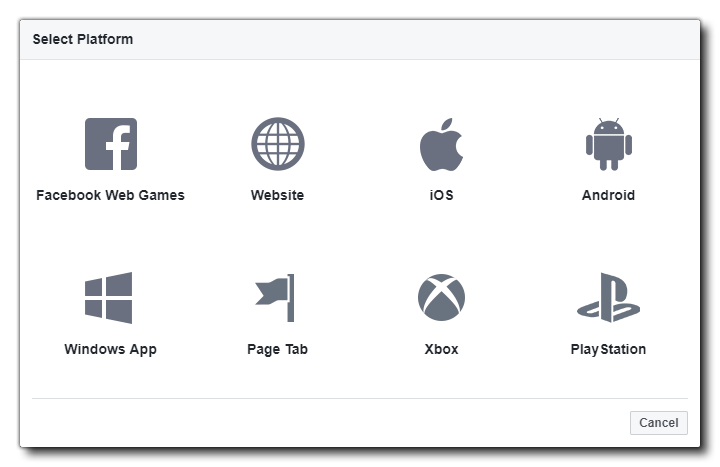
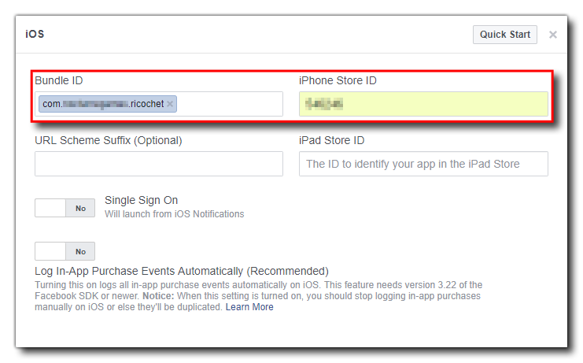
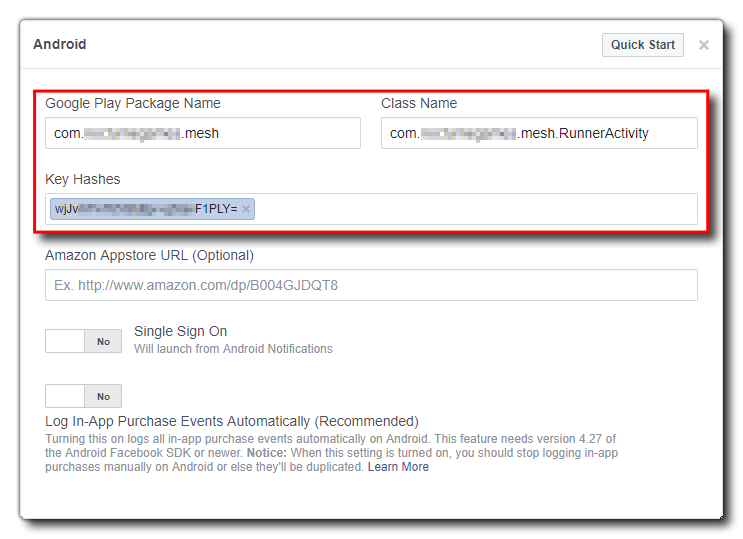
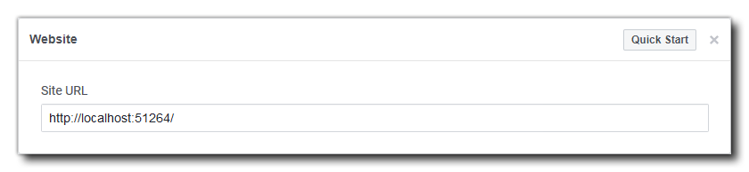
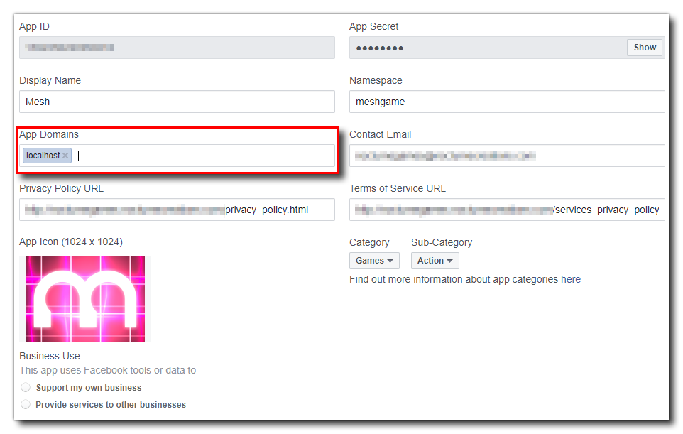
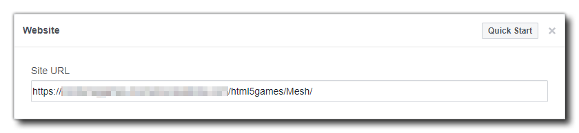
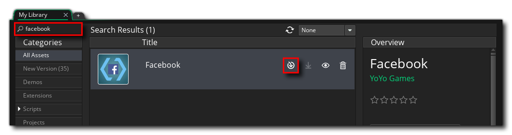
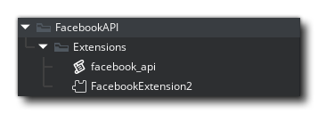
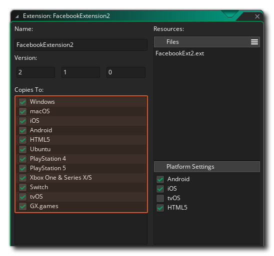

@title Setup Guide

This guide provides you with the information required to integrate Facebook with your Android, iOS and/or HTML5 game using the [Facebook extension](https://marketplace.gamemaker.io/assets/2011/facebook/).

The Facebook extension can be used to communicate with the various Facebook APIs made available by the platform.

> See: [Meta Developer Documentation](https://developers.facebook.com/docs/) for more information

## Creating An App

The first step is Creating An App on Facebook: 

> See: [Create an App](https://developers.facebook.com/docs/development/create-an-app)

You should take note of the **App ID** and **App Secret** as you'll need them later in GameMaker. Now, take a moment to update or change the name, email, and other details of your app:

Next, you will be presented with the **Data Protection Officer's Contact Information**. This is a requirement under GDPR by European Law and you should fill in the required details. When finished you can then click the **Add Platform** button at the bottom:



Here you should choose either iOS, Android or Website if you are publishing an HTML5 game.

### iOS

Selecting iOS will open the setup window for iOS devices to use your app. You will need to have set up an iTunes listing for your game and have a **Bundle ID** and an **App ID** (see the [Apple documentation](https://help.apple.com/app-store-connect/#/dev219b53a88) for more information) which you will need to add in here (make sure that the Bundle ID matches that of the [iOS Game Options](https://manual.gamemaker.io/monthly/en/Settings/Game_Options/iOS.htm) for your game):



You can ignore the rest of the options in this window and continue on to add details for the Android version of your game. If you aren't adding Android or HTML5 for now, scroll to the bottom of the page and click **Save Changes**.

### Android

Selecting Android will open up the setup window for Android devices. You will need to have set up a Google Play store listing for your game and will need your **Package Name** and **Key Hash**. The package name is the reverse URL identifier used for your game on the Play Store (and it should match that used in the [Android Game Options](https://manual.gamemaker.io/monthly/en/Settings/Game_Options/Android.htm) for your game). You can get the hash key from the [Android Preferences](https://manual.gamemaker.io/monthly/en/Setting_Up_And_Version_Information/Platform_Preferences/Android.htm)' **Keystore** section. Use them to fill in the Android options:



Note that you also need to add a **Class Name** which should be formatted as:

> <Your_Package_Name>.RunnerActivity

As shown in the screenshot above.

You can ignore the rest of the options in this window and scroll to the bottom of the page where you should click the button labelled **Save Changes**, unless you want to set up a website with an HTML5 game.

### Website (HTML5)

If you choose **Website**, then you have two options, depending on whether you want to test your game running it from GameMaker, or whether you want to have the game hosted "live" on a server.

For testing the game from GameMaker, you need to set the **Site URL** to:

```
http://localhost:51264/
```



Then go to the Basic game settings and set the App Domain to `localhost`:



This will permit you test your game when running it from within GameMaker.

If you want to host it on a server as a published game, then you'll be required to fill in the **Site URL** so it points to the location of your game. Note that Facebook will require your game to be hosted on a site with a valid SSL certificate and the link should be HTTPS.



With that done, you can now click **Save Changes** and move on to setting up GameMaker.

## GameMaker

Now in GameMaker, the first thing you need to do is add the Facebook extension to your project. For that, you need to add the extension to your account [on the Marketplace](https://marketplace.gamemaker.io/assets/2011/facebook/). Once added, go to **Marketplace** -> **My Library** in GameMaker and then download and install the Facebook asset (you can find it easily using the search function):



[[IMPORTANT: You should make sure to add all of the extensions' files.]]

You should now open the Facebook extension asset from the Asset Browser (**FacebookExtension2**):



First of all, make sure that it's going to be exported *only* to those platforms where you are going to use it:



Now open the menu for your target platform under "**Extra Platforms**" (Android/iOS) and add your Facebook app details in the Extension Options. You can find any relevant app details under **Settings** -> **Basic** on your Facebook dashboard.

> See: [Basic Settings](https://developers.facebook.com/docs/development/create-an-app/app-dashboard/basic-settings)

### Common

In the Extension Options, set the **App ID** to your Facebook App ID.

### Android

In the **General** section of the [Android Game Options](https://manual.gamemaker.io/monthly/en/Settings/Game_Options/Android.htm), set up the API levels to use. The Facebook extension requires the following API settings as a *minimum* to work:

* Build Tools: **26.0.2**
* Support Library: **26.0.0**
* Target SDK: **26**
* Minimum SDK: **19**
* Compile SDK: **26**

Once you've filled that in (and made sure you have the relevant APIs installed in Android Studio), you can continue on to add the code that will access the Facebook API.

### iOS

On iOS, set your **Client Token** (which you can get from your Facebook dashboard under **Settings** -> **Advanced** -> **Client Token**) and **Display Name** (which is the name of your application) in the Extension Options.

### OAuth

OAuth uses the **App ID** set above and additionally requires an **OAuth Redirect URL**. This is the URL to which Facebook will send the code it generates after you make the initial request using either ${function.fb_login} (SDK platforms) or ${function.fb_login_oauth} (other platforms or as an alternative login method on SDK platforms).

You can, for example, add the Firebase extension to your project and make use of the [Firebase Cloud Functions](https://github.com/YoYoGames/GMEXT-Firebase/wiki/cloud_functions) to make the request for the token.

## Adding Facebook Functions

When adding Facebook integration to your game, we recommend that you create *a persistent* controller object that will be added to the very first room of your game and persist throughout. This is because a lot of the Facebook functionality *is asynchronous* and so it's better to have a single object that is dedicated to dealing with the different callbacks, although your buttons and things themselves don't have to be persistent. The rest of this tutorial assumes you have such an object in your game.

### Logging In

To start adding Facebook functionality to your game you will first need to ensure that the extension is installed correctly and set to export to the supported platforms. The extension contains the function ${function.fb_init} which you should call first in the **Create Event** of the controller object: 

```gml
fb_init();
```

[[Note: this is a change from previous versions of the extension to guarantee a correct initialisation order of the different extensions that you might use in a project.]]

In the Create event we'll also initialise some variables that we'll need later as well as an ${type.array} with the basic permissions required (more on this later) and some variables to control the different permission requests:

```gml
fb_init();
fb_logged_in = false;
fb_read_permissions = false;
fb_publish_permissions = false;
fb_userid = "";
fb_username = "";
fb_picture = -1;
fb_permissions = ["public_profile", "user_friends"];
```

Once you've called that, you can then check that the Facebook Graph API has initialised correctly using the extension function ${function.fb_ready} (in an alarm or the Step event). This will return `true` or `false`, depending on whether the Graph API is initialised or not, and can be checked before changing the room or starting the game proper. Once it returns `true`, you can then call the function to log the user in.

Normally you wouldn't log the user in automatically on game start - although you *can* -  but instead have a button in the game that the user can press to log in and use Facebook. However you do it though, you'll need to call the extension function ${function.fb_login}. This function requires you to supply an array with the permissions that you want to have for the user logging in.

[[IMPORTANT: You can only request the default **read** permissions with this function. If you require additional read or write permissions after logging in you will need to specifically request them (see the **Additional Permissions** section, below). Also note that if your game requires more than the `"public_profile"`, `"email"` and/or `"user_friends"` it will [require review by Facebook](https://developers.facebook.com/docs/facebook-login/review/what-is-login-review) before it can be used by people other than the game's developers.]]

The actual login code will look something like this:

```gml
if (fb_status() != "AUTHORISED")
{
    fb_login(["public_profile", "user_friends"]);
}
```

Note that we first check to see if the game has already been authorised since the login state can be persisted over various runs of the game, and if not then we log the user in.

[[Note: You can check the different status results and react in different ways depending on what is returned. This isn't covered in this article to keep things simple.]]

When you call this function, it will generate a ${event.social} with the results of the login attempt. In this event, the ${var.async_load} DS map will contain a `"type"` key, which will hold the string `"facebook_login_result"` when the event is triggered by logging in. There will also be a `"status"` key which returns whether the login was a `"success"`, was `"cancelled"` or if it failed with an `"error"`.

If the login status key is `"success"`, then the user has logged in and you can go ahead and check each of the permissions you have requested to see if they have been "granted" or not.

You can check this with the following code:

```gml
switch (async_load[? "type"])
{
    case "facebook_login_result":
        show_debug_message("facebook_login_result async event triggered");
        if (async_load[? "status"] == "success")
        {
            if (!fb_logged_in)
            {
                fb_logged_in = true;
                show_debug_message("User successfully logged in!");
                for (var i = 0; i < array_length(fb_permissions); ++i;)
                {
                        var _key = fb_permissions[i];
                        if (ds_map_exists(async_load, _key))
                        {
                            if (async_load[? _key] == "granted")
                            {
                                show_debug_message("Permission "+ _key + ": " + async_load[? _key]);
                            }
                            else
                            {
                                show_debug_message("Permission "+ _key + ": "+ async_load[? _key]);
                            }
                        }
                        else
                        {
                            show_debug_message("Permission " + _key + ": Does Not Exist");
                        }
                }
            }
        }
        else
        {
            show_debug_message("Login failed: " + string(async_load[? "status"]));
        }
        break;
}
```

The above code looks complex, but all it's doing is checking to see if the event was triggered by a login, and if it was then it parses the ${var.async_load} map and outputs the permission, whether it was granted or not. In general, you don't really *need* all that code, but we've added debug messages in to cover every eventuality so that you can see whether the code is working (or not!) in the console output. Note that there are further keys returned in the ${var.async_load} map, which are explained more fully in the PDF manual.

### Getting User Data

Once the user has logged in you can start to do **graph requests** to get more information about them, which you can then incorporate into your game. To formulate a graph request you'd use the ${function.fb_graph_request}, something like this in the controller's ${event.social}, when the login has been confirmed (you could also add it to a Key Press or Mouse Press event):

```gml
params =
{
    "fields": "id,name,picture"
};

fb_graph_request("me", "GET", params);
```

Here we first create the struct with the requested parameters. A more complex example could be:

```gml
params = 
{
    "id": "123",
    "name": "John Doe",
    "picture", "http://url-to-picture.jpg")
};
```

In the case of our test code, we're targeting the `"/me/"` node, which means that all data you retrieve comes from the logged-in user.

[[Note: A node is an individual Facebook object with a unique ID. For example, a single user, the logged-in user or a business would all be considered nodes. Returned data for the different nodes will be limited by the permissions requested and set on the account targeted.]]

So, we create a struct with the data we want to request then call the ${function.fb_graph_request} function as a `"GET"` call, supplying the data.

[[IMPORTANT: With the basic permissions, you can only request very specific data from the open graph. You can find a [list of available default requests here](https://developers.facebook.com/docs/facebook-login/permissions/v3.0#reference-default_fields).]]

In the ${event.social} again, we need to retrieve the data from the DS map and use it to set some variables. For this, we'll simply add a new `case` into the `switch` that checks for `"type"`:

```gml
case "fb_graph_request":
    show_debug_message("fb_graph_request async event triggered");
    if (async_load[? "status"] == "success")
    {
        show_debug_message("Graph Request Successful!");
        var _text = async_load[? "response_text"];
        var _response = json_parse(_text);
        show_debug_message("Response = " + string(_response));
        fb_username = _response.name;
        fb_userid = _response.id;
        var _pic = _response.picture;
        var _data = _pic.data;
        fb_picture = sprite_add(_data.url, 0, false, false, 0, 0);
    }
    else
    {
        if (async_load[? "status"] == "error")
        {
            show_debug_message("Graph Request Error!");
            show_debug_message("Exception = " + string(async_load[? "exception"]));
        }
        else
        {
            show_debug_message("Graph request Cancelled!");
        }
    }
    break;
```

Here we use the returned data to set the variables that hold the user name and user ID. These can then be used to display personalised messages and content in your game. Note that we also extract the `"data"` struct from the `"picture"` key and then use that to create a new sprite for the user avatar. In this case, the variable only holds the request ID as loading the picture will be handled by the ${event.image_loaded}, which you would deal with as follows:

```gml
if (async_load[? "id"] != fb_picture) { exit; }
if (async_load[? "status"] < 0) { exit; }

sprite_index = fb_picture;
```

All that does is take the returned avatar sprite and set the user profile to use it. Don't forget that this sprite will need to be deleted when no longer required (using ${function.sprite_delete}).

Graph requests are a very powerful tool and this is just one example of how to use them to get data. However, we can't go into all the details of each and every node here, so we recommend that you check the extensive documentation on the Facebook developer pages, as well as the **Graph API Explorer**, which lets you test nodes and see what data is returned, etc.:

* [Graph API Reference](https://developers.facebook.com/docs/graph-api/reference)
* [Graph API Explorer Guide](https://developers.facebook.com/docs/graph-api/explorer)

Also, note that the Facebook Extension Demo project also shows different uses of the graph request function to get friend's data and delete permissions among other things.

### Additional Permissions

It may be that your game requires additional read or publish permissions, so you'll need to request these and have the user agree to grant them. For this, we use the functions ${function.fb_request_read_permissions} and ${function.fb_request_publish_permissions}. Now, before continuing, it's very important to note that these functions *will log the user into Facebook again*, and so if any of the permissions are not granted or there is an error, the function ${function.fb_status} will return `"FAILED"`, but **the user will still be logged in**, they just won't have the requested permissions.

In general, you'd want to request additional permissions directly after getting a successful user login callback in the ${event.social}, so that's where we'll be adding the following code, after the initial `fb_logged_in` check, in the same async type, `"facebook_login_result"`:

```gml
case "facebook_login_result":
    show_debug_message("facebook_login_result async event triggered");
    if (async_load[? "status"] == "success")
    {
        if (!fb_logged_in)
        {
            // Login code shown above here
        }
        if (fb_logged_in)
        {
            if (!fb_check_permission("user_birthday"))
            {
                fb_request_read_permissions(["user_birthday"]);
                show_debug_message("Requesting READ permissions - user_birthday");
            }
            else
            {
                show_debug_message("READ Permission Granted");
                fb_read_permissions = true;
                if (!fb_check_permission("publish_to_groups"))
                {
                    fb_request_publish_permissions(["publish_to_groups"]);
                    show_debug_message("Requesting PUBLISH permissions - publish_to_groups");
                }
                else
                {
                    fb_publish_permissions = true;
                    show_debug_message("PUBLISH Permission Granted");
                }
            }
        }
    }
    else
    {
        show_debug_message("Login failed: " + string(async_load[? "status"]));
    }
    break;
```

As you can see from the code above, we first check to see if the user already has the required read permission and if they don't we request it. This will trigger another login ${event.social}, where we can check to see if the permission was granted and then request publish permissions (which in turn will trigger another ${event.social}).

[[Note: The "publish" permissions are pretty much obsolete and only used for some very specific things. In general, you can ignore them and simply request read permissions.]]

For a full list of the permissions that you can request, see this Facebook Developer article:

> [Permissions Reference - Facebook Login](https://developers.facebook.com/docs/facebook-login/permissions/v3.0)

### Posting To Facebook

You now have your user data as well as the permissions you require for your game. you can use the user data to interact with the user by applying their avatar to achievements, in-game identifiers, etc., but you may also want to let the user share information about the game with other people on Facebook. For that, we have the function ${function.fb_dialog}.

This function can be called from anywhere in your game and would look something like this:

```gml
if (fb_status() == "AUTHORISED")
{
    fb_dialog("http://link.com");
}
```

A few things to note when using this function:

* The user does NOT have to be logged in when it is called, as the function will request the user log in if they're not already.
* The URL you supply should link to a page related to the content being shared.
* The dialog message will be populated using the Open Graph meta tags embedded in the header of the URL you give. An example of this would be:
```
<meta property=”og:title” content=”Mesh - Fast Finger Fun!” />
<meta property=”og:url” content=”http://www.nocturnegames.com” />
<meta property=”og:description” content=”Mesh is a frenzied neon arcade game where quick fingers are needed to score points and combos as you try to beat your previous high scores!” />
<meta property=”og:image” content=”https://m.gjcdn.net/screenshot-thumbnail/900x2000/334601-v3.jpg” />
```

For more information on Open Graph meta tags, please see:

> [The Open Graph Protocol](https://ogp.me)