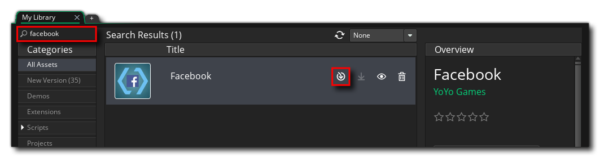

@title Setup

# Setup

This guide covers everything you have to do outside your game's code before the Facebook extension
will work: creating an app on Meta's developer dashboard, registering your Android and iOS builds
against it, and installing and configuring the extension in GameMaker.

Once this is done, see ${page.getting_started} for the call order in GML, and
${page.extension_options} for what each of the extension's options is for.

[[Warning: This extension supports **Android and iOS only**. There is no HTML5, Windows, macOS or
Linux implementation - on those targets every function returns a default value and nothing reaches
Meta.]]

## 1. Create an app on the Meta dashboard

Everything starts with an app on Meta's developer dashboard, and with three values from it that
GameMaker needs later: the **App ID**, the **Display Name** and the **Client Token**.

> [Create an App](https://developers.facebook.com/docs/development/create-an-app)

Meta documents its own dashboard, so this guide does not restate it. ${page.dashboard} is the map - it
walks Meta's documentation in the order a GameMaker project needs it, and says exactly where each of
the three values lives.

[[Warning: The **App Secret** on the Basic settings page is a server-side credential. It is not one of
the three, this extension never asks for it, and it must never be shipped inside a game.]]

## 2. Add your platforms

Meta will not accept traffic from a build it does not recognise, so each platform you ship on has to be
registered against the app.

> [Platform Settings](https://developers.facebook.com/docs/development/create-an-app/app-dashboard/platform-settings)

The fields Meta asks for there are filled in with values that come out of GameMaker rather than out of
Meta's documentation, so those are below.

### iOS

Add the **iOS** platform and fill in your **Bundle ID**. It must match the bundle identifier in your
game's [iOS Game Options](https://manual.gamemaker.io/monthly/en/Settings/Game_Options/iOS.htm)
exactly - a mismatch is the single most common reason login silently fails on a device.

### Android

Add the **Android** platform and fill in three fields:

| Field | Where it comes from |
|---|---|
| **Package Name** | The reverse-domain identifier from your game's [Android Game Options](https://manual.gamemaker.io/monthly/en/Settings/Game_Options/Android.htm). |
| **Class Name** | Your package name followed by `.RunnerActivity`, e.g. `com.company.game.RunnerActivity`. |
| **Key Hash** | The keystore hash, from the **Keystore** section of the [Android Platform Preferences](https://manual.gamemaker.io/monthly/en/Setting_Up_And_Version_Information/Platform_Preferences/Android.htm). |

[[Important: The key hash is per keystore, not per app. A build signed with your debug keystore and a
build signed with your release keystore produce different hashes, and Meta rejects a login from a hash
it has not been given - so add **both**.]]

Save your changes on the dashboard before moving on.

## 3. Install the extension in GameMaker

Add the extension to your account on the
[Marketplace](https://marketplace.gamemaker.io/assets/2011/facebook/), then in GameMaker go to
**Marketplace** -> **My Library**, find it with the search box, and download and install it into your
project:

[[Important: Make sure every one of the extension's files is added when you import it.]]

## 4. Fill in the extension options

Open the **GMFacebook** extension from the Asset Browser and fill in the three values you noted down in
step 1 - **App ID**, **Display Name** and **Client Token**. All three are required, and
${function.fb_initialize} fails if the App ID or the Client Token is left empty.

See ${page.extension_options} for the full list, and for the Android and iOS project settings the
extension needs.

The extension writes everything else Meta requires - the Android manifest entries and string
resources, the iOS plist keys and URL scheme, the Gradle dependency and the CocoaPods pods - on your
behalf when the project is built. There is nothing to paste into the injection boxes by hand.

## 5. Build and test

Facebook logins cannot be tested in the IDE - the SDK is native, so you need a real Android or iOS
build on a device or emulator.

* **Before App Review**, only people with a role on the app can log in, and only `public_profile`,
`email` and `user_friends` are available. Everyone else sees a login failure. ${page.dashboard} covers
roles, test users and App Review.
* **App Events** are batched by the SDK, so a freshly sent event will not appear in the Events Manager
straight away. Call ${function.fb_flush_events} to push them immediately while testing.
* Anything beyond the three basic permissions has to go through App Review before it works for the
public.
